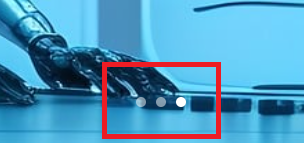

# Webpage Messanger Project 

# A part of Component Functions

## MainStage.tsx ( Main )
- Tab Component
- Center Component

## App.tsx ( Sub )

- button 

## Tab.tsx ( Fixed Container )

- 광고 배너

- 클라이언트 사용 탭 
### @media ( max-width : 900px ) 페이지 사이즈 900px 단위로 뷰 재설정

## Center.tsx 

- Background Images (3 images)
- 7초마다 화면 슬라이드
- 3개의 컨테이너를 33.33333% 비율로 나누어 전환 ( 추후 수정 예정 )

- Arrow button 
- 클릭시 화면 슬라이드 효과

- Page Indicator
- 현재 클라이언트가 보고있는 페이지 알림 